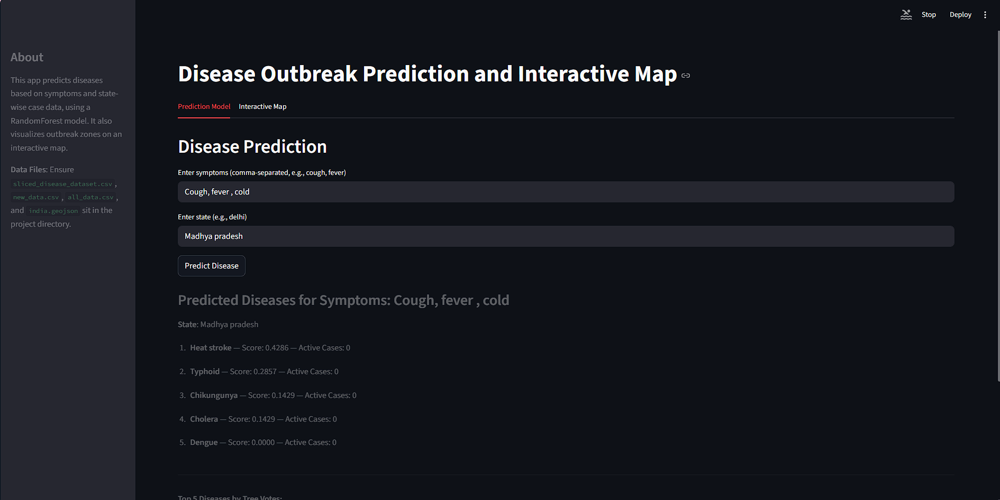
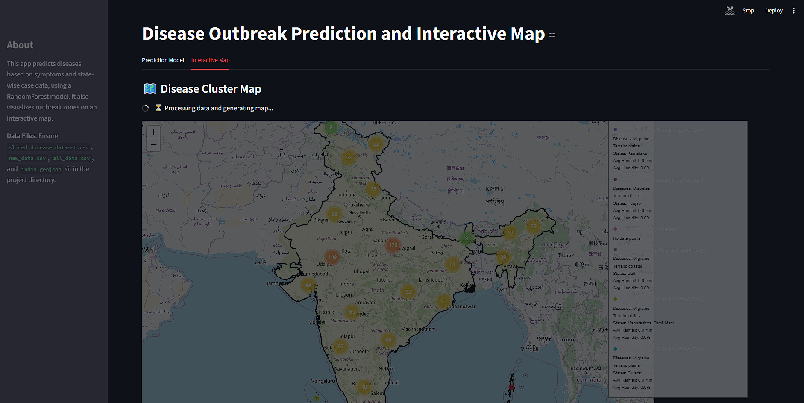

# 🏥 Disease Outbreak Prediction and Interactive Map

<div align="center">


**An intelligent web application that predicts diseases based on symptoms and visualizes disease clusters on an interactive map of India using Machine Learning.**

[Features](#-features) • [Installation](#-installation) • [Usage](#-usage) • [Screenshots](#-screenshots) • [Technology Stack](#-technology-stack)

</div>

---

## 📋 Table of Contents

- [Overview](#-overview)
- [Features](#-features)
- [Screenshots](#-screenshots)
- [Technology Stack](#-technology-stack)
- [Installation](#-installation)
- [Usage](#-usage)
- [Project Structure](#-project-structure)
- [How It Works](#-how-it-works)
- [Contributing](#-contributing)
- [License](#-license)

---

## 🎯 Overview

This project is a comprehensive disease prediction system that combines machine learning with geographic data visualization. It helps users:

- **Predict diseases** based on symptoms using a Random Forest classifier
- **Visualize disease clusters** on an interactive map of India
- **Integrate state-wise data** to provide location-aware predictions
- **Analyze outbreak patterns** through geographic clustering

The application uses a trained Random Forest model to predict diseases from symptoms and enhances predictions by considering state-wise active case data. The interactive map feature visualizes disease clusters across different regions of India, helping identify outbreak zones and patterns.

---

## ✨ Features

### 🔮 Disease Prediction
- **Symptom-based prediction**: Enter comma-separated symptoms to get disease predictions
- **State-aware predictions**: Considers active cases in your state for more accurate results
- **Top 5 predictions**: Shows the most likely diseases with confidence scores
- **Tree voting visualization**: See how individual decision trees vote for each disease

### 🗺️ Interactive Map Visualization
- **Geographic clustering**: K-means clustering of disease outbreaks by location
- **Interactive markers**: Click on clusters to see detailed disease information
- **Cluster information**: View terrain, states, rainfall, and humidity data for each cluster
- **India boundary overlay**: Accurate geographic representation of India

### 🤖 Machine Learning
- **Random Forest Classifier**: Ensemble learning for robust predictions
- **Hyperparameter optimization**: Randomized search for optimal model parameters
- **Stratified sampling**: Balanced train-test split for better model performance

---

## 📸 Screenshots

### Disease Prediction Interface



*The prediction interface allows users to enter symptoms and state information to get disease predictions with confidence scores and active case data.*

**Features shown:**
- Input fields for symptoms and state
- Top 5 predicted diseases with scores
- Active cases per disease
- Tree voting results

### Interactive Map Visualization



*The interactive map displays disease clusters across India with detailed information about each cluster zone.*

**Features shown:**
- Geographic clustering of disease outbreaks
- Color-coded cluster markers
- Detailed cluster information panel
- India boundary overlay

---

## 🛠️ Technology Stack

### Core Technologies
- **Python 3.7+**: Programming language
- **Streamlit**: Web application framework
- **scikit-learn**: Machine learning library
- **Pandas**: Data manipulation and analysis
- **NumPy**: Numerical computing

### Visualization & Mapping
- **Folium**: Interactive map generation
- **streamlit-folium**: Streamlit integration for Folium maps
- **GeoPandas**: Geospatial data processing
- **Matplotlib**: Data visualization

### Machine Learning
- **Random Forest Classifier**: Ensemble learning algorithm
- **K-Means Clustering**: Geographic clustering
- **Label Encoding**: Categorical data encoding

---

## 📦 Installation

### Prerequisites

- Python 3.7 or higher
- pip (Python package installer)
- Git (for cloning the repository)

### Step-by-Step Installation

1. **Clone the repository**
   ```bash
   git clone https://github.com/po0mpomm/Disease-Prediction-model.git
   cd Disease-Prediction-model
   ```

2. **Create a virtual environment** (Recommended)
   ```bash
   python -m venv venv
   ```
   
   **Activate the virtual environment:**
   - **Windows (PowerShell):**
     ```bash
     .\venv\Scripts\Activate.ps1
     ```
   - **Windows (Command Prompt):**
     ```bash
     venv\Scripts\activate.bat
     ```
   - **macOS/Linux:**
     ```bash
     source venv/bin/activate
     ```

3. **Install dependencies**
   ```bash
   pip install -r requirements.txt
   ```

   **Note:** If you encounter issues installing `geopandas` on Windows:
   ```bash
   pip install pipwin
   pipwin install geopandas
   ```

4. **Verify required data files**
   
   Ensure the following files are present in the project directory:
   - ✅ `sliced_disease_dataset.csv` - Symptom dataset for training
   - ✅ `new_data.csv` - State-wise disease data
   - ✅ `all_data.csv` - Complete dataset for mapping
   - ✅ `india.geojson` - India boundary data for map visualization

---

## 🚀 Usage

### Running the Application

1. **Start the Streamlit application**
   ```bash
   streamlit run main.py
   ```

2. **Access the application**
   - The application will automatically open in your default web browser
   - Default URL: `http://localhost:8501`
   - If the port is busy, Streamlit will use the next available port

### Using the Prediction Model

1. Navigate to the **"Prediction Model"** tab
2. Enter symptoms (comma-separated), e.g., `cough, fever, fatigue`
3. Enter a state name, e.g., `delhi`, `punjab`, `madhya pradesh`
4. Click the **"Predict Disease"** button
5. View the results:
   - Top 5 predicted diseases with confidence scores
   - Active cases for each disease in the selected state
   - Tree voting breakdown from the Random Forest model

### Using the Interactive Map

1. Navigate to the **"Interactive Map"** tab
2. Wait for the map to load (processing may take a few seconds)
3. Explore the map:
   - Click on cluster markers to see disease information
   - View the cluster legend on the right side
   - Zoom in/out to explore different regions
   - Check cluster details including terrain, states, and environmental data

---

## 📁 Project Structure

```
Disease-Prediction-model/
│
├── main.py                      # Main Streamlit application
├── app2.py                      # Map visualization module
├── requirements.txt             # Python dependencies
├── README.md                    # Project documentation
├── .gitignore                   # Git ignore file
│
├── Data Files/
│   ├── sliced_disease_dataset.csv    # Symptom dataset for training
│   ├── new_data.csv                  # State-wise disease data
│   ├── all_data.csv                  # Complete dataset for mapping
│   └── india.geojson                 # India boundary data
│
├── Models/
│   ├── model1.pkl              # Pre-trained model (if available)
│   └── model2.pkl              # Pre-trained model (if available)
│
└── screenshots/                 # Application screenshots
    ├── prediction-interface.png
    └── interactive-map.png
```

---

## 🔬 How It Works

### Disease Prediction Pipeline

1. **Data Preprocessing**
   - Loads symptom dataset and state-wise disease data
   - Encodes categorical variables using Label Encoding
   - Creates feature vectors from symptom inputs

2. **Model Training**
   - Uses Stratified Shuffle Split for balanced train-test split
   - Trains Random Forest Classifier with hyperparameter optimization
   - Performs Randomized Search CV for optimal parameters

3. **Prediction Process**
   - Converts user symptoms to binary feature vector
   - Generates probability scores for all diseases
   - Enhances predictions using state-wise active case data
   - Ranks diseases by combined score (model probability + case data)

4. **Visualization**
   - Displays top 5 predictions with scores
   - Shows tree voting breakdown from Random Forest

### Map Clustering Pipeline

1. **Data Processing**
   - Loads geographic and disease data
   - Filters data points within India boundaries
   - Encodes diseases for clustering

2. **Clustering**
   - Applies K-Means clustering (10 clusters) on latitude, longitude, and disease
   - Groups similar disease outbreaks geographically

3. **Visualization**
   - Creates interactive Folium map
   - Adds cluster markers with color coding
   - Displays cluster information including terrain, states, and environmental factors

---

## 🐛 Troubleshooting

### Common Issues

**Issue: ModuleNotFoundError**
- **Solution:** Ensure all dependencies are installed:
  ```bash
  pip install -r requirements.txt
  ```

**Issue: FileNotFoundError for CSV/GeoJSON files**
- **Solution:** Verify all data files are in the same directory as `main.py`

**Issue: Port already in use**
- **Solution:** Specify a different port:
  ```bash
  streamlit run main.py --server.port 8502
  ```

**Issue: geopandas installation fails on Windows**
- **Solution:** Use pipwin:
  ```bash
  pip install pipwin
  pipwin install geopandas
  ```

**Issue: Map not loading**
- **Solution:** Ensure `india.geojson` is in the project directory and check internet connection for map tiles

---

## 🤝 Contributing

Contributions are welcome! Please feel free to submit a Pull Request. For major changes, please open an issue first to discuss what you would like to change.

1. Fork the repository
2. Create your feature branch (`git checkout -b feature/AmazingFeature`)
3. Commit your changes (`git commit -m 'Add some AmazingFeature'`)
4. Push to the branch (`git push origin feature/AmazingFeature`)
5. Open a Pull Request

---

## 📝 License

This project is licensed under the MIT License - see the LICENSE file for details.

---

## 👤 Author

**po0mpomm**

- GitHub: [@po0mpomm](https://github.com/po0mpomm)
- Repository: [Disease-Prediction-model](https://github.com/po0mpomm/Disease-Prediction-model)

---

## 🙏 Acknowledgments

- Streamlit team for the amazing framework
- scikit-learn for machine learning tools
- Folium for interactive mapping capabilities
- OpenStreetMap for map tiles

---

<div align="center">

**⭐ If you find this project helpful, please consider giving it a star! ⭐**

Made with ❤️ using Python and Streamlit

</div>
